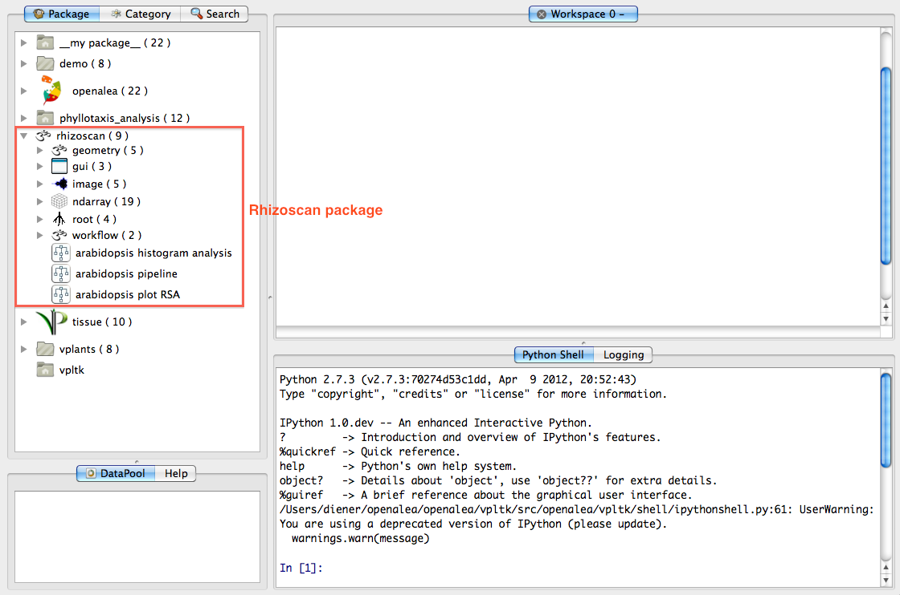

.. _rhizoscan_visualea_tuto:

Root image analysis with visualea
========================================

`Visualea`_ provide a graphical iterface to use openalea components which does not require any programming. If you have installed the :ref:`rhizoscan package <rhizoscan>`, it should appear in the `package manager`_ (click on the triangle on the left of **rhizoscan** in the package manager to open it and display the package content):

.. _Visualea: http://openalea.gforge.inria.fr/doc/openalea/visualea/doc/_build/html/contents.html
.. _package manager: http://openalea.gforge.inria.fr/doc/openalea/visualea/doc/_build/html/user/manual.html#package-manager

Three tutorials have been made to show how to use this package functionalities. The rhizoscan package comes with a couple of image data which the following tutorials are made to process by default: so you can just go and try.

:ref:`rhizoscan_visualea_tuto_image`

    This allows to extract root system architecture from one image file. It is also usefull for testing the image pipeline an a couple of images before processing a whole image data set.

:ref:`rhizoscan_visualea_tuto_database`

    Once the pipeline parameters are choosen, a large image set can be analysed automatically using a *database* system. This tutorial show how this works.
    
:ref:`rhizoscan_visualea_tuto_db_analysis`

    Here this tutorial show simple ways to plot extracted root system, show comparative measurement on processed database, and export analysis to table files.

--------------------------------------------------------------------------------

**Related documentation**

.. toctree:: 
    :maxdepth: 2
    
    tuto_visualea_image.rst
    tuto_visualea_database.rst
    tuto_visualea_dbanalysis.rst
    tutorial_script.rst
    

