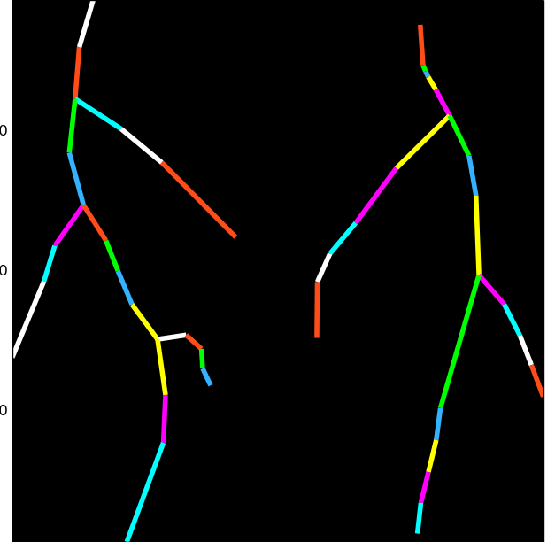
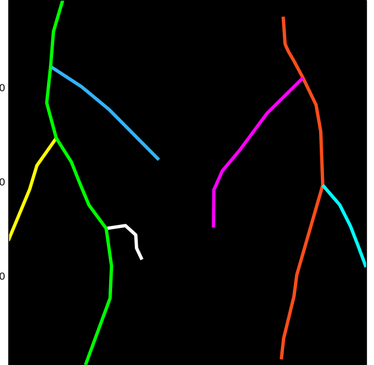

.. _rhizoscan_script_tuto:

Root image analysis with python
========================================

This tutorial provides the description of how to do analyse root images with rhiziscan using the python programming language. A `minimal knowledge`_ of python is recommanded.

.. _minimal knowledge: http://docs.python.org/2/tutorial/introduction.html

.. contents:: Content of this tutorial
   :local:
   
.. section-numbering
    
To process one root image, you will needs:
  - to select an image (or image file name) to be analysed
  - to choose the suitable pipeline parameters

In this tutorial, we use an image provided with the package:

>>> from rhizoscan import get_data_path
>>>
>>> filename = get_data_path('pipeline/arabido.png')
>>> assert os.path.exists(filename), "could not find test image file:"+filename 

Step by step image analysis
+++++++++++++++++++++++++++

First import the rhizoscan modules we need, and matplotlib to view intermediary output:

>>> from rhizoscan.root.pipeline import load_image, detect_petri_plate, compute_graph, compute_tree
>>> from rhizoscan.root.pipeline.arabidopsis import segment_image, detect_leaves
>>> 
>>> from matplotlib import pyplot as plt

First step: load the image from file:

>>> image = load_image(image_filename)
>>> plt.imshow(image);

.. image:: tuto_script_image.png
    :width: 200px
    :align: center

Then find the petri plate in the image, as a image mask

>>> rmask, bbox = segment_image(image,pmask,root_max_radius=5)
>>> plt.imshow(rmask);

.. image:: tuto_script_rmask.png
    :width: 200px
    :align: center

Find the seed of the root system:

>>> seed_map = detect_leaves(rmask, image, bbox, plant_number=2, leaf_bbox=[0,0,1,.4])
>>> plt.imshow(seed_map);
>>> #plt.imshow(seed_map+rmask);   # to view the seed map on top of the binary mask

.. image:: tuto_script_seed_map.png
    :width: 200px
    :align: center

Compute the graph for the root system

>>> graph = compute_graph(rmask,seed_map,bbox)
>>> graph.plot()

Finally, compute the RSA tree:

>>> tree = compute_tree(graph, px_scale=px_scale)
>>> tree.plot()

It is probably necessary to convert this RSA tree to MTG format, for interoperability:

>>> from rhizoscan.root.graph.mtg import tree_to_mtg
>>> rsa = tree_to_mtg(tree)

Here is the full code:

>>> from rhizoscan.root.pipeline import load_image, detect_petri_plate, compute_graph, compute_tree
>>> from rhizoscan.root.pipeline.arabidopsis import segment_image, detect_leaves
>>> 
>>> from matplotlib import pyplot as plt
>>> 
>>> image = load_image(image_filename)
>>> plt.imshow(image);
>>> 
>>> rmask, bbox = segment_image(image,pmask,root_max_radius=5)
>>> plt.imshow(rmask);
>>> 
>>> 
>>> seed_map = detect_leaves(rmask, image, bbox, plant_number=2, leaf_bbox=[0,0,1,.4])
>>> plt.imshow(seed_map);
>>> #plt.imshow(seed_map+rmask);
>>> 
>>> graph = compute_graph(rmask,seed_map,bbox)
>>> graph.plot()
>>> 
>>> tree = compute_tree(graph, px_scale=px_scale)
>>> tree.plot()
>>>
>>> from rhizoscan.root.graph.mtg import tree_to_mtg
>>> rsa = tree_to_mtg(tree)

Using the arabidopsis pipeline
++++++++++++++++++++++++++++++

The above steps are all contained in :ref:`the arabidopsis pipeline <arabidopsis-pipeline>` which is used slike this:

>>> from rhizoscan.root.pipeline.arabidopsis import pipeline
>>> from rhizoscan.datastructure import Mapping
>>> 
>>> # 1. Create a namespace to execute the pipeline with input image filename and parameters
>>> d = Mapping(filename=filename, plant_number=2,
>>>             fg_smooth=1, border_width=.08,leaf_bbox=[0,0,1,.4],root_max_radius=5, verbose=1)
>>> 
>>> # 2. Run the pipeline
>>> pipeline.run(namespace=d);
>>>
>>> # 3. Access computed data (example)
>>> d.tree.plot()       # plot the estimated RSA (use an internal RSA graph structure)
>>>
>>> d.rsa               # estimated RSA as a MTG
>>> # <openalea.mtg.mtg.MTG at 0x.....>  

:TODO: explain the relation between pipeline and namespace

Computed data, final RSA as well as intermediate data, can be store in a given output folder. To do this, one should set the output directory for the namespace, and give the list of data that should be stored:

>>> # set the namespace output directory
>>> import tempfile, os
>>> outdir = tempfile.mkdtemp()                 # create a temporary directory
>>> d.set_file(os.path.join(outdir,'test'), storage=True)
>>>
>>> # run the pipeline, setting which data to store
>>> pipeline.run(namespace=d, store=['pmask','rmask','seed_map','tree','rsa'])

:TODO: describe pipeline parameters, or link to pipeline doc

.. note::
    The file name of the storage files will all start by the value of ``test`` and a suffix made from the data name. E.g. the ̀``seed_map`` image use the suffix "_seed_map.png", so in our example a file ``[outdir]/test_seed_map.png`` will be created. 

    Once you have finished with the computed data, don't forget to delete it: either manually using your OS file manager, or with python::

    	import shutil
        shutil.rmtree(outdir)

Dataset analysis
----------------

:TODO: update doc

An :ref:`image database <image-database>` can be process easily. For example, using the testing databse of rhizoscan, this is done using the following::
    
    from rhizoscan import get_data_path
    from rhizoscan.root.pipeline import database
    from rhizoscan.root.pipeline.arabidopsis import pipeline
    
    db = get_data_path('pipeline/arabidopsis/database.ini')
    db, invalid, outdir = database.parse_image_db(db) 

    for elt in db:
        pipeline.run(elt)

.. todo:: To finish

      - what are hidden the paremeter => cf :ref:`pipeline api<arabidopsis-pipeline-API>`
      - how to get output data (ex 'tree')

Finally, if your don't need it anymore, remove the output directory used by the pipeline::
    
    import shutil
    shutil.rmtree(outdir)

Visualisation and measurements
------------------------------

.. Note:: Most of the following requires a matplotlib

.. todo:: split in the 2 previous parts? 

    plotting graph & tree
    exemple of getting some measurement from a tree: root.measurement

.. visualea: http://openalea.gforge.inria.fr/dokuwiki/doku.php?id=documentation:user:visual_programming

