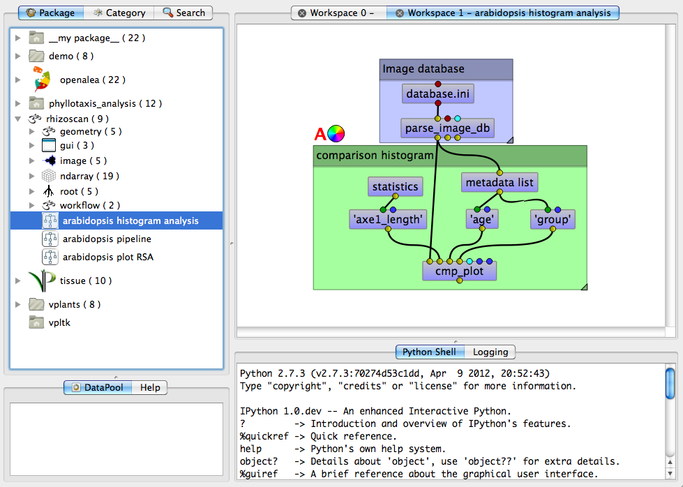

.. _rhizoscan_visualea_tuto_db_analysis:

Visualisation of the extracted root system with visualea
========================================================

Ploting comparative histogram
-----------------------------

The rhizoscan package provide a simple tool to compare measured root system visually: open the dataflow **arabidopsis histogram analysis** at the bottom of the rhizoscan package:

    
This dataflow as two parts:
  - The upper part is the database loader: select the database file using the top modules (named *databse.ini*)
  - The second part provide the plotting tools:
    - the module **cmp_plot** do the plot. To start it right click on it and select **run**. The plot is done with respect to three main inputs
    - the one on the left (*axe1_length* in the example) is the measurement to plot. Double click on the module to open the selection interface.
    - The center one (*age*) indicates the metadata name that contains the  
